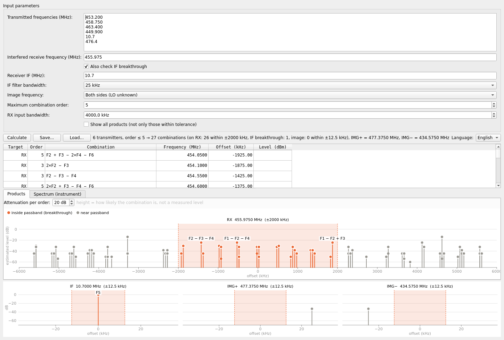
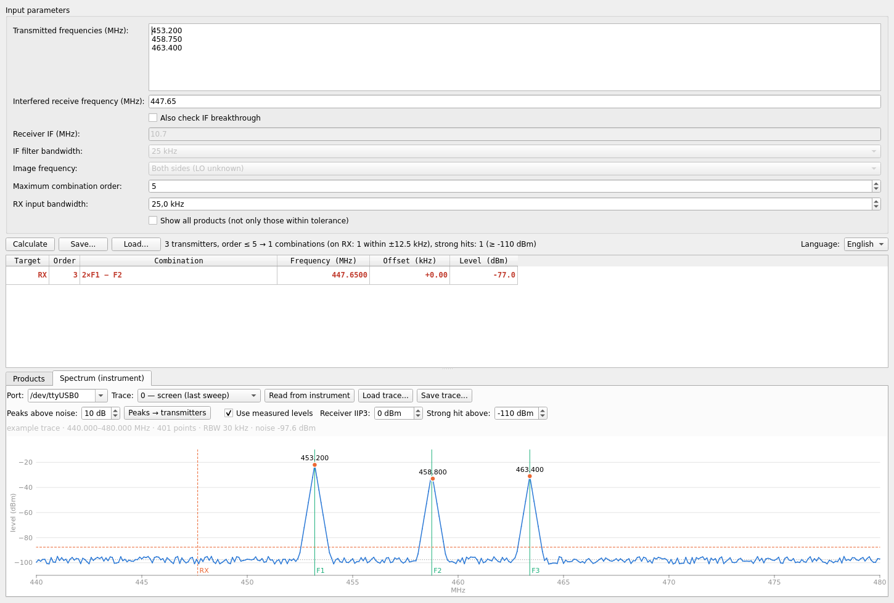

# Intermod — frequency combination & breakthrough calculator

A desktop tool for radio sites: given the frequencies transmitted at a location
and the frequency on which a receiver is being interfered with, it finds every
**intermodulation / harmonic product** `|k1·F1 + k2·F2 + … + kn·Fn|` that can
explain the interference — on the **receive frequency**, **directly on the
receiver's IF**, or on the **image frequency**.

It can also read a spectrum trace straight from an **Anritsu MS2711D Spectrum
Master** (or load one from a CSV file) and use the *measured* transmitter
levels to estimate how strong each product really is.

English / Serbian user interface (switchable at runtime).



## Features

- Any number of transmitters, combination order up to 10
  (order = Σ|ki|; harmonics included, duplicates ±k removed).
- Three kinds of breakthrough, each checked in its own passband:
  - **RX** – product falls into the receiver input bandwidth,
  - **IF** – product falls directly on the intermediate frequency
    (including a transmitter sitting right on the IF),
  - **Image** – product falls on `RX ± 2·IF` (LO above, below, or both).
- Graphical view: one panel per target, passband shaded, products near the
  passband edge shown too, hover for details, click to select the table row.
- Without measurements, line height is an estimate of how *likely* a
  combination is (higher order → weaker; products of more distinct transmitters
  are theoretically stronger, e.g. F1+F2−F3 is 6 dB above 2F1−F2).
- Flexible input: `453.2`, `453,2`, `455 kHz`, `2.4 GHz`, one per line or
  separated by `, ` / `;`.
- Save / load a complete frequency set as JSON.
- Protection against huge calculations freezing the window.

### Measured spectrum (Anritsu MS2711D)



- **Read from instrument** over RS-232 (null-modem cable or USB-serial adapter,
  9600 8N1): the current screen trace or any of the 200 stored traces.
  The instrument is only *read* — nothing is written to it.
- **Load / save trace** as CSV (`frequency, level_dBm`; MHz or Hz is detected
  automatically), so field measurements can be analysed later.
- Peak detection above the noise floor; **Peaks → transmitters** fills in the
  transmitter list.
- **Use measured levels**: each product level is estimated from the measured
  transmitter levels and the receiver IIP3:
  `P = Σ|ki|·Pi − (n−1)·IIP3` (e.g. 2F1−F2: `2·P1 + P2 − 2·IIP3`).
  Products above the *strong hit* threshold are highlighted in red.
  For orders other than 3 this is a rough estimate (the same intercept point
  is used), and levels are those at the analyzer input, not the receiver's.

The serial protocol follows the *MS2711D Programming Manual* (10580-00098):
commands #69 Enter Remote, #24 Query Trace Names, #33 Recall Sweep Trace,
#255 Exit Remote. Tested with an MS2711D, firmware 3.31.

## Installation

Requires Python 3.10+.

```bash
git clone https://github.com/<your-account>/intermod.git
cd intermod
python -m venv venv
source venv/bin/activate          # Windows: venv\Scripts\activate
pip install -r requirements.txt
python intermod.py
```

On Linux the `intermod` launcher script runs the program from `venv/`.
To access a serial port on Linux your user must be in the `dialout` group
(or the port must be otherwise accessible).

A ready-to-run Linux binary is available on the Releases page.

### Building a standalone binary

```bash
pip install pyinstaller
pyinstaller --noconfirm intermod-kalkulator.spec
# result: dist/intermod-kalkulator  (dist\intermod-kalkulator.exe on Windows)
```

## Try it

`examples/example-set.json` (Load…) and
`examples/example-trace-440-480MHz.csv` (Spectrum tab → Load trace…) are a
small synthetic example: three UHF transmitters whose 2F1−F2 product lands on
the receive frequency.

## Srpski

Program računa sve kombinacije emitovanih frekvencija (intermodulacija i
harmonici) koje padaju na prijemnu frekvenciju, direktno na međufrekvenciju
ili na lik frekvenciju, i prikazuje ih tabelarno i grafički. Može da preuzme
spektralni trag sa Anritsu MS2711D (ili iz CSV fajla) i da iz izmerenih nivoa
predajnika proceni nivo svakog proizvoda. Jezik interfejsa se bira u prozoru
(English / Srpski).

## License

MIT — see [LICENSE](LICENSE). Uses PySide6 (LGPL) and pyserial (BSD).
